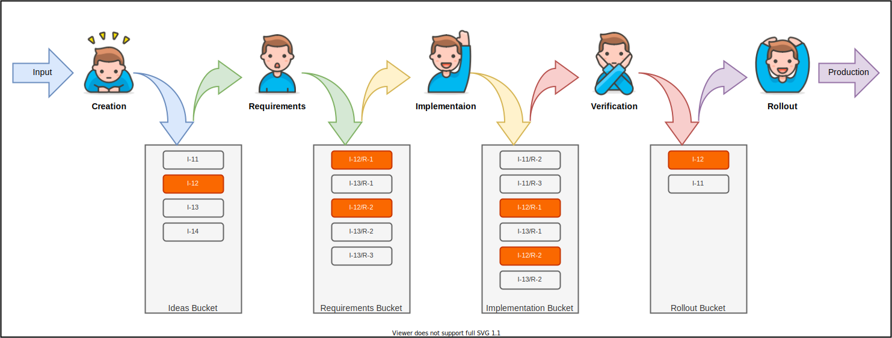
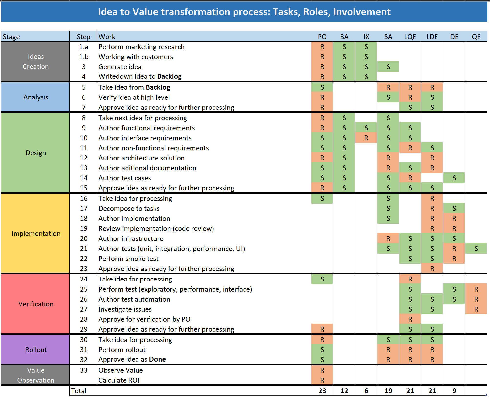

# Continuous Production

## Plot

Continuous Production aka **CP** is a flow production method that allows to build the most efficient process of transformation **Idea** to **Value** within the software soultion lifecyle.
Important to define the **Idea** - is a concept of actions the implementation of which will lead to an **increase** in net **profit**.
By increase in profit both cost reduction and revenue increase are considered and by efficiency both time and money are considered.

**CP** is adaptive and [value-driven](https://en.wikipedia.org/wiki/Agile_software_development#Adaptive_vs._predictive) approach.
It means that it is focused on adapting quickly to rapidly changing circumstances and at the same time on bringing value to the business as soon as possible.

**CP** is designed in the way that if only today an idea on how to increase a profit has appeared, the company has the most efficient process for a team to transform this idea in actual value.

**CP** is a more efficient and reality close variant of the [Kanban](https://en.wikipedia.org/wiki/Kanban_(development)) approach.

## Digression

It is crucial to accept the fact that in most Software Projects work can be done when it can be done and not earlier.
The reason for that is unlike in [Construction](https://en.wikipedia.org/wiki/Construction), from which projects are originated, in software development it is impossible to predict or estimate time required to perform the work.
This happens because of 2 major reasons:

### Rapid changes
Unlike in Construction, in Software Projects external factors and requirements are changing too often, and too often there is a situation that current solution can not support new requirements and significant rework is required.
Interesting point is that for most of people it is easy to understand that on late stages of a building construction it is impossible to change the shape, purpose, add or remove floors. But at the same time they do not understand that exactly the same rules are applied to the software solutions.

### No statistics to estimate
In Construction there is a superior statistics collected about executed projects and literally it has been collected for ages.
This allows to split Construction Project in to well known, due to statistics, phases and what is more important each phase can be splitted in simple, well known, executed gazillion times [operations](https://en.wikipedia.org/wiki/Operations_management). And time required to execute the operation is well known, due to statistics.

Software Projects are relatively young discipline so there is a too few statistic collected, also variety of Software Solutions compared to any other descipline is a way higher. Even if Software Project is splitted to phases and each phase is splitted ot operations/tasks there is no way to provide time estimates to exact operations/tasks. Because when it comes to estimation of exact operation/task by exact individual, to make it the individual must have significant experience and statistics on executing exact operation under exact circumstances and conditions. Not even slightly different - exact.
And almost always this is a case: individuals are going to do the exact task for a first time and circumstance are going to be different.

Unfortunately for most of the companies which practieces [predictvie](https://en.wikipedia.org/wiki/Agile_software_development#Adaptive_vs._predictive) approaches for Software Projects, the estimates, which are exhausted by the managers from the engineers, are nothing more than just a guess or a lie, believe you or not.
And this actually reflected by statistics, you may easily find in internet that most of Software Projects either exceed time and budget or just failing.

## CP Process Decomposition 

Actual process of transforming **Idea** to **Value** consists of 5 simple higlevel steps:
1. Analysis
1. Design (Requirements Production)
1. Implementation
1. Verification
1. Rollout

Usualy based on research, input from business side or customers, **Ideas** are created.
As mentioned earlier Idea is right anything, that if implemented will bring profit to the company.
Once originated - Ideas are putted into the **backlog** and considered as **ToDo**, and actual **CP** process starts.

Lets take a closer look at the steps:

### Analysis
At this step, ideas are taken from **Backlog** and analised.
First point to analyze - if this idea will realy bring a profit.
Second point to analyze - what is a best way to implement it, considering all current conditions and circumastances like architecture.
The results of this stage are placed in **Ideas Bucket** in order to be considered for requirements production on the design.

### Design (Requirements Production)
At this steps, ideas are taken from **Ideas Bucket** and process of designing ouccurs.
During this step requirements are created that must contain exhaustive information, which is enough for engineers to implement and verify.
There must be functional requirements, non function requirements and steps required to verify.
The results of this step are placed into **Design Bucket** in order to be considered for implementation.

### Implementation
On this steps, requirements are taken from **Design Bucket** and implemented.
It is important to note that engineers which implement the requiremnts get more understanding by reading test cases on how they should perfom initial verification that they did everything right.
The results of this step are placed into **Implementation Bucket** in order to be considered for verification.

### Verification
On this step, implementation is taken from **Implementation Bucket** and verified against the requirements.
The goal of this track is to ensure that actual implementation meets all the requirements which were originally specified.
The results of this step are placed into **Rollout Bucket** in order to be delivered to customers.

### Rollout
On this step, value which is ready to rollout is taken from **Rollout Bucket** and delivered to the consumers.

### Sequential Process Visualization

Below is a visualization of the process from the sequence view.

## Teams and Threads

At this point we have an understanding what high level steps should be performed to transform **Idea** to **Value**.
Each step takes time to perform and there are dependencies between steps.

In sake of efficiency, same type of the steps should be performed on separate thread by a separate team.
This bring us to the idea on having 5 parallel teams/threads.

To avoid the teams/threads syncronisation or reduce the effort on this - the concept of bucket is utilised.
The place where each team/thread puts result of their work and othre thread consuems it.

It is important to understand why bucket instead of list is considered.
This happens because items for further processing may be taken based on different reasons, likely this is priority but it also may be logical dependency and other reasons.

### Parallel Process Visualization

Below is a visualization of the process from the parallel view.

## Notes to consider

At last visualization it's clear to see that less idle occurs, because each thread and team takes next work to do whenever it is possible.
And this is why time boundaries like weeks or artificial sprints makes no sense.

At this point it should be clear that there is no sense in low level planing, because work occurs as soon as input occurs.
This is why it is important to have bucket full of ideas ready for the next step.

### Rule
There should be only one rule to follow, is that each team\thread must constantly have something on input.

## Roles and Responsibilities
Here we may see roles and their responsibilites within the process.

### Legend

| Acronym | Full
|:----|:----
| PO  | Product Owner
| BA  | Business Analyst
| IX  | Interface & Experienc
| SA  | Solutions Architect
| LQE | Lead Quality Engineer
| LDE | Lead Dev Engineer
| DE  | Dev Engineer
| QE  | Quality Engineer
| **R** | Responsible
| **S** | Supports

## Cross cuting example
Bellow is an example on how the process might look like for company which develops software to work with customers.

Step 0 : Cretaion
Based on customer input PO decidedes to implement a scheduler that would allow customers to schedule appointments online.

Step 1 : Analysis.
After discussion with SA, it has been decided to implement with O365 \ Exchange \ Calendar.

Step 2 : Design.
PO works together with SA and QE on exact requirements on how to implement functionality are created, test steps required to test functionality are created also.

Step 3: Implementation.
LDE takes requirement, splits the work between engineers and implementes.
Engineers perform initial verification that everything is done according to requirements

Step 4: Verification.
LQE pefroms tests against the requirements and test cases.
If only implementation meets PO expectations it is considered for rollout.

Step 5: Rollout.
Functionality to schedule the appointments appears in the applications, education materials are prepared, users are informed about new possibilities.
